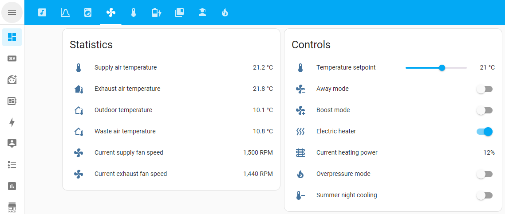
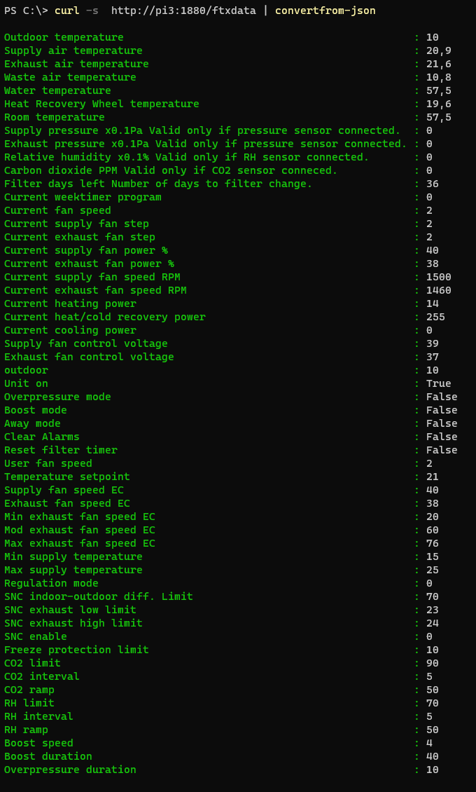
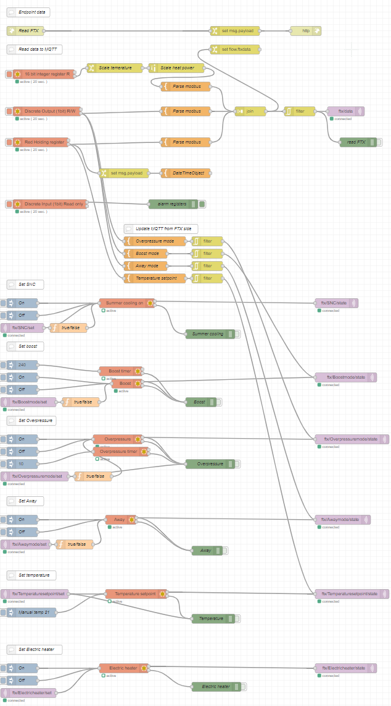
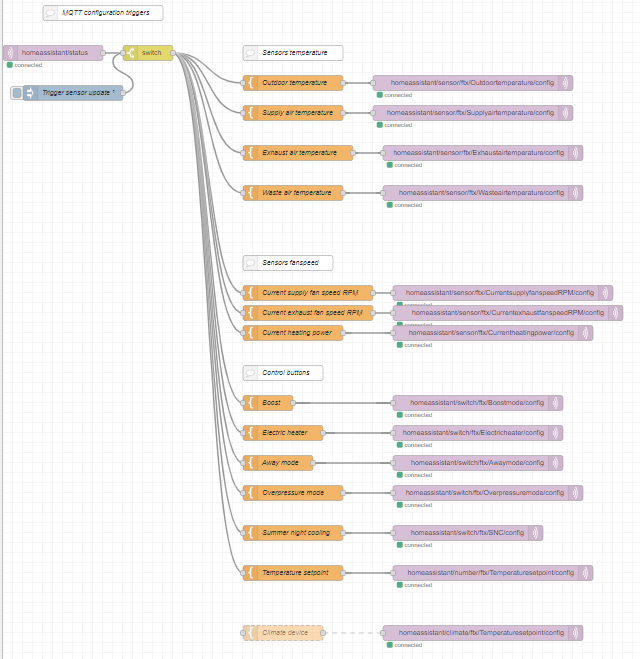

# Heru FTX to Home assistant

Creates Home assistant sensors, switches and numbers to control FTX by Modbus using;
- MQTT in your environment
- Home assistant in your environment with default discovery prefix (homeassistant) 
- Modbus RTU interface as device to container
- Node-red with [Modbus community](https://flows.nodered.org/node/node-red-contrib-modbus) npm

## Installation

### Docker run
```cmd
docker run -it --rm -p 1880:1880 --name testenv /
-e MQTTServer=mqtt.dev.local -e mqttserverport=1883  /
  --device /dev/tty10:/dev/ttySC0 klaspihl/node-red-heru
```

### Docker-compose
```yaml
services:
  nodered:
    image: klaspihl/node-red-heru:latest
    environment:
      - MQTT_Server=mqtt.dev.local
      - MQTT_Server_Port=1883
    ports:
      - "1880:1880"
    devices:
      - /dev/tty1:/dev/ttySC0
```


## Usage

MQTT server and port configurable by environment variables. If credentials is needed open flow and set.

Admin password to node-red: heru

## Project
[Github](https://github.com/klaspihl/Node-Red-Heru)

## Result
Home assistant entities


## Bonus

REST endpoint to read [FTX status](doc/Endpoint_json1.json)


## Node-red

### Flow



### MQTT auto discovery


